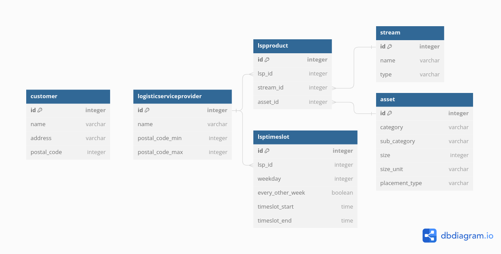

# seenons-assignment

Solution for the Seenons technical assignment.

Deployed demo link: https://rjoaquinito-seenons-assignment.onrender.com/api/

## Tech stack
This solution uses Django and the Django REST Framework to create the REST API. The API is documented with the Swagger UI. 

The database used is PostgreSQL, and it's hosted in [ElephantSQL](http://elephantsql.com). 

The demo is hosted in [Render](http://render.com).

## Database
The database contains 6 tables: 
* **customer**: data about the customers, including postal code
* **stream**: data about the streams
* **asset**: data about the assets
* **logisticserviceprovider**: data about the logistics service providers, including the postal code range
* **lspproduct**: products (stream + asset) that a certain logistic service provider can deliver
* **lsptimeslot**: timeslots (weekday and time) when a certain logistic service provider is available



## API
The API has 7 endpoints. The documentation for the API is available on [**/api/docs**](https://rjoaquinito-seenons-assignment.onrender.com/api/docs/).

Each database table has its own endpoint with GET, POST and DELETE methods. 

The requested endpoint for this assignment is [**/api/products**](https://rjoaquinito-seenons-assignment.onrender.com/api/products).

To conveniently test the endpoints, you may use Django REST Framework's browsable API or the Swagger UI.

## Interpretation of requirements and design decisions

### Regarding the timeslots
- A timeslot is attributed to a Logistics Service Provider (LSP), not to a LSP Product (stream+asset).
- When adding a new timeslot for a LSP, you may add just the day of the week. If no start time is provided, it is assumed that the LSP will be available during the entire day (this is how I interpreted the "*" in the example).
- All timeslots with a defined start time will be 2 hours long. End time cannot be defined by the user.
- Timeslots have the 'every other week' option, since in the example there is a "every second friday".
- Timeslots of a LSP can overlap each other, since in the example there was a 13:30-18:00 availability for one LSP. In that case, I assume there would be timeslots starting at 13:30, 15:30 and 16:00.
- Timeslots can start anytime between 06:00 and 20:00.

### Regarding the postal codes
- The postal codes are between 1000 and 9999.


## Requirements

* Python 3.11

* A file named *.env* is required in the root directory with the following content:
```
DJANGO_SECRET_KEY=<secret_key>
DJANGO_DEBUG=True
ELEPHANTSQL_URL=<elephantsql_url>
```

## Setup and run locally

* In the root directory, run:
  ```
  python -m venv venv
  source venv/bin/activate
  pip install -r requirements.txt
  ```

* Run the Django server
  ```
  python django_seenons/manage.py runserver
  ```
